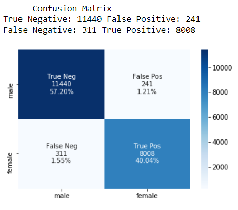
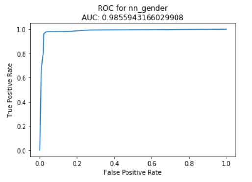

# Facial Recognition - An experiment with Logistic Regression
Using logistic regression model to solve some real-world problems, we can explorer different possibilities and outcomes.

### Question Answered by Logistic Regression

Similar to linear regression, logistic regression maps elements in the input space the to discrete outputs. It answers what the (log odds of) probability that an array of grayscale pixels from human face represents a certain gender, age, and ethnicity.

### Alternative

Decision tree/random forest can also be used to solve this problem since these models work well with the dataset used here.

### Data Scraping - *Scrapy*

Initialize project: `scrapy startproject mySpider`

Start scraping: `scrapy runspider mySpider.py`

#### Mechanism of Scrapy


- Spiders are responsible for propagating requests and parse the response to *item*;
- Requests are send to remote server with random user-agent;
- Pipelines receives parsed items and process them one-by-one, and this is where the data are stored to MongoDB;
- Items with `images_url` are captured by `ImagesPipeline`, and sent to `ProxyUADownloaderMiddleware` ;
- Rejected downloading requests are resend using different proxies from the IP pool;

### Dataset

The dataset is obtained from scraping the page https://generated.photos/faces/. The images are downloaded, stored in *MongoDB* and to reduce the pressure to my laptop, they are resized to 64x64 and made into grayscale. Labels are extracted from the link to image, and they're stored along with the link to image. The outline of the database is shown below. (key resembles what is in the dataset)

| key         | type      | note                                                         |
| ----------- | --------- | ------------------------------------------------------------ |
| pixels      | List[] |  |
| gender      | str       | gender  |
| age         | str       | age |
| ethnicity   | str       | ethnicity  |
| emotion     | str       | emotion  |
| hair_color  | str       | hair_color  |
| eye_color   | str       | eye_color  |
| hair_length | str       | hair_length  |

Please contact me to acquire the dataset :)

## Training Outputs

- Identify gender

  

- Identify age

  

- Identify ethnicity

  

## Model Analysis

### Confusion Matrix



#### Interpretation

- Out of 20000 pairs of tests, the model correctly predicts 97.24% of them.
- This set of data is not biased in gender.

### McFadden's Rho-squared

The McFadden's rho-squared is shown as follow:


and for the theta null, we set it to be an array of all zeros except for the leading one.

```
McFadden's pseudo R-squared: 0.31467801021392716
```

### ROC-AUC

 

#### Interpretations

- The closer the curve is to the upper-left corner, the better performance the model does; This is because we want the model to have a higher TPR while having a lower FPR.
- The closer the AUC to 1, the better the prediction this model can do.

## Demo

Run `python visualizer.py` to discover!

### Further Improvement

- Train with RGB data since it has better result in predicting *eye_color*, *hair_color*, and *ethnicity*.
- Try using `scrapy_splash` to render JS.
- Implement a decision tree for the same sake.

